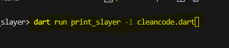

print_slayer is a Flutter/dart package designed to remove print() and debugPrint() statements from your Dart source code files. It helps ensure that no unwanted print statements are left in your production code.

## Features

- Removes print statements from Dart source code files.
- Removes debugPrint statements from Dart source code files.
- Command-line interface (CLI) for easy execution.
- Optional ability to ignore specific files during the cleanup process.
- Re-formats code after removing the print() statements

## Getting started

To use print_slayer in your Dart or Flutter project, add it as a dependency in your `pubspec.yaml` file:

```yaml
dependencies:
  print_slayer: ^1.1.0
```

or

```yaml
dev_dependencies:
  print_slayer: ^1.1.0
```

You can also run the `dart pub get print_slayer`

## Usage

Run the print_slayer in the CLI using the commands: `dart run print_slayer [options]`.
Note that the [options] are optional command-line arguments.


- dart run print_slayer: removes print() statements from all .dart files without exception


- dart run print_slayer --ignore filename.dart: ignores the specified file

- dart run print_slayer -i filename.dart: ignores the specified file

- dart run print_slayer --ignore file1.dart --ignore file2.dart: ignores multiple specified files

- dart run print_slayer -i file1.dart -i file2.dart: ignores multiple specified files


- dart run print_slayer -d: include debugPrint in the code cleanup


- dart run print_slayer -h: help

- dart run print_slayer --help: help


## Additional information

You want to connect? Connect Here:

- [LinkedIn](https://www.linkedin.com/in/prince-samuel-941956165/)
- [GitHub](https://github.com/DevPrinceK)
- [Email](princesamuelpks@gmail.com)
